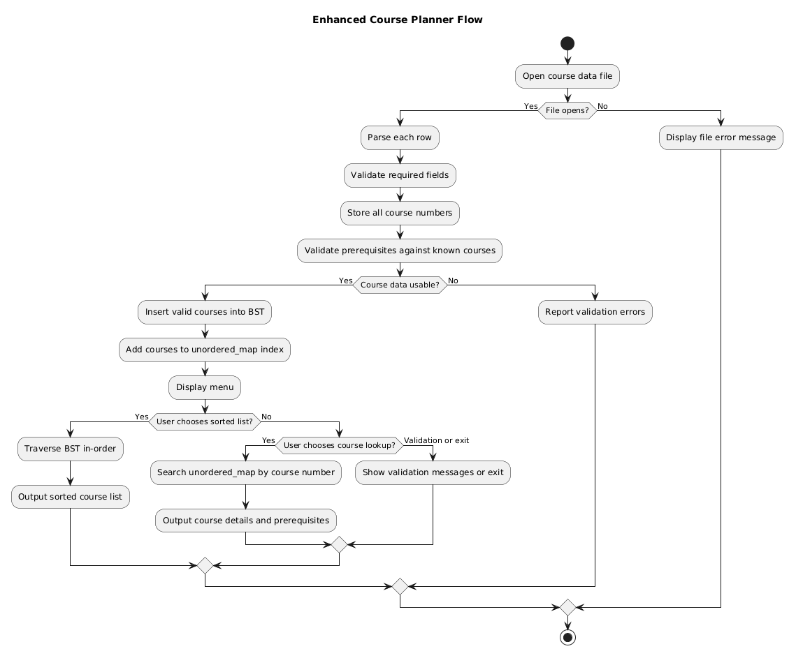

# Enhancement Two: Algorithms and Data Structures

## Artifact Overview

**Artifact:** CS 300 Course Planner  
**Course:** CS 300: Data Structures and Algorithms: Analysis and Design  
**Category:** Algorithms and Data Structures

The original Course Planner was a C++ application that loaded course records and used a Binary Search Tree to output courses in alphanumeric order.

## Enhancement Summary

The enhanced version preserves the Binary Search Tree for sorted traversal and adds `unordered_map` lookup, prerequisite parsing, two-pass prerequisite validation, malformed-row handling, duplicate detection, and runtime evidence.

## Original Artifact

- [Original CS 300 Files](artifacts/cs300/original/)

## Enhanced Artifact

- [Enhanced CS 300 Files](artifacts/cs300/enhanced/)
- [Enhanced Course Planner Source](artifacts/cs300/enhanced/CoursePlanner_Enhanced.cpp)
- [Final CS 300 Artifact ZIP](artifacts/cs300/CS499_Final_Artifact_2_CS300_CoursePlanner_Polished.zip)

## Flowchart

## Evidence and Testing

- [Valid Run Output](artifacts/cs300/evidence/valid_run_output.txt)
- [Error Run Output](artifacts/cs300/evidence/error_run_output.txt)
- [Valid Course Data](artifacts/cs300/enhanced/courses_valid.csv)
- [Error Course Data](artifacts/cs300/enhanced/courses_with_errors.csv)

## Narrative

- [Download Enhancement Two Narrative](narratives/CS300_Enhancement_Two_Narrative.docx)

[Back to Home](index.md)
